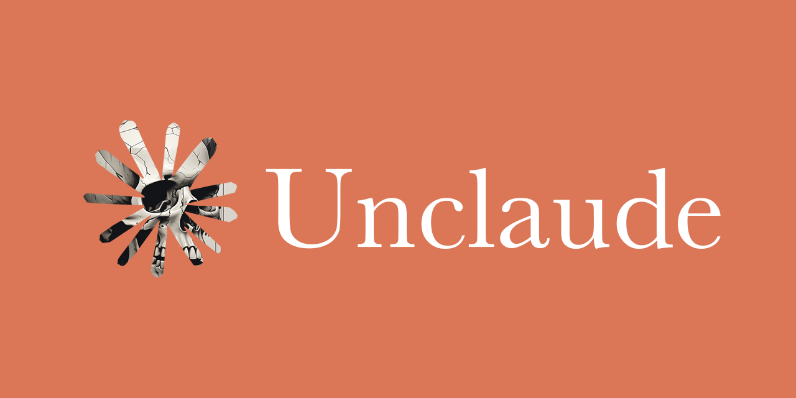

# unclaude

A utility that returns your repository to human hands.

Removes traces left behind by AI coding assistants — Claude Code, Codex CLI, Cursor, Continue, Aider, GitHub Copilot — including tool directories, instruction files, source comments, and commit-message footers. The repository is left reflecting only your intentional work.

Not a rejection of AI assistance, but a choice about what remains.

**Safe by default:** Runs in preview mode unless you explicitly use `--apply`.

Tools for the digital human experience.

## What Gets Removed

**AI tool directories** (anywhere in the tree):
- `.claude/`, `.codex/`, `.cursor/`, `.continue/`, `.aider/`

**AI tool files** (anywhere in the tree — these override the `docs/` allowlist):
- `CLAUDE.md`, `AGENTS.md`
- `.mcp.json`, `.claude.json`, `.claudeignore`
- `.cursorrules`, `.cursorignore`
- `.aider.conf.yml`, `.aider.input.history`, `.aider.chat.history.md`
- `.github/copilot-instructions.md`

**Markdown files** (with allowlist):
- Root `README.md` preserved
- `docs/`, `doc/`, `adr/` subtrees preserved (except AI tool files above)

**Source code comments** containing:
- Vendor mentions: Claude, Anthropic, Codex, ChatGPT, OpenAI
- AI assistance markers: AI-assisted, AI-generated, AI-created, AI-powered
- Generation tags: Generated/Created/Built with/by (AI|Claude|Codex|…)
- Session URLs: claude.ai, claude.com, anthropic.com, chatgpt.com, openai.com

Comments are removed correctly whether they're standalone (whole line dropped), end-of-line (only the comment stripped, code preserved), or multi-line block comments (`/* … */`, `""" … """`, `<!-- … -->`).

**Commit message footers**:
- `Co-Authored-By: Claude <…@anthropic.com>` and friends
- `Co-Authored-By: Codex|ChatGPT <…@openai.com>`
- Generation footers: `[Claude Code]`, `(Codex CLI)`, `Generated with …`
- Session permalinks: `claude.ai/code/session_…`, `chatgpt.com/share/…`
- Emoji badges (🤖, 🔧, ✨) with generation markers
- Trailing signatures (`- Claude`, `- Codex`, …)

## Installation

```bash
go install github.com/antisynthesis/unclaude@latest
```

Build from source:

```bash
git clone https://github.com/antisynthesis/unclaude.git
cd unclaude
make build
```

## Usage

**By default, `unclaude` runs in preview mode** — showing what would be changed without modifying anything.

Preview your repository:
```bash
unclaude
```

Apply changes:
```bash
unclaude --apply
```

Specify a path:
```bash
unclaude --apply /path/to/repo
```

### Options

```
--apply             Apply changes (default is preview mode)
-i, --interactive   Prompt before deleting each markdown file (requires --apply)
-v, --verbose       Show debug-level output
    --quiet         Suppress info-level output; only warnings and errors
    --json          Emit logs as JSON instead of human-readable console
    --purge-refs    After history rewrite, delete refs/original/ and run aggressive gc
-h, --help          Display usage information
```

### Output

`unclaude` logs to stdout using [Uber's zap](https://github.com/uber-go/zap) with RFC3339 timestamps. Default is human-readable console output; pass `--json` for structured logs (useful in CI pre-commit hooks).

```
2025-05-23T14:02:18Z  INFO  preview mode (no changes will be made); use --apply to modify the repository
2025-05-23T14:02:18Z  INFO  removing ai tool directory  {"path": ".claude"}
2025-05-23T14:02:18Z  INFO  removing ai tool file       {"path": "CLAUDE.md"}
2025-05-23T14:02:18Z  INFO  markdown removal summary    {"removed": 2}
```

### Examples

Preview mode (default, safe):
```bash
unclaude
unclaude --verbose
unclaude --json    # machine-readable
```

Apply changes with interactive prompts:
```bash
unclaude --apply --interactive
```

Apply changes and purge git backup refs:
```bash
unclaude --apply --purge-refs
```

**Important:** Preview mode is the default. Use `--apply` only when you're ready to make permanent changes.

## Git History Rewriting

`unclaude` prefers [`git-filter-repo`](https://github.com/newren/git-filter-repo) when it is available on `PATH` — this is the rewriting tool the Git project recommends since `filter-branch` was deprecated. If `git-filter-repo` is not installed, `unclaude` falls back to `git filter-branch` and emits a warning.

After the rewrite, `unclaude` leaves the original refs under `refs/original/` by default so you can recover if something looks wrong. Pass `--purge-refs` to delete them and run `git gc --prune=now --aggressive` immediately.

**Safety measures:**
- Preview mode by default — no changes without `--apply`
- Scans commit history first to detect AI traces
- Only prompts for confirmation if changes are actually needed
- Aborts if there are unstaged changes (in apply mode)
- Backup refs preserved by default (`refs/original/`)
- Warns that signed commits will be invalidated by the rewrite

History rewriting is permanent and changes all commit hashes downstream of the rewritten commits. Coordinate with your team before running on a shared branch.

## Requirements

- Go 1.21+
- Git (for history operations)
- Optional but recommended: `git-filter-repo` (for the non-deprecated rewrite path)

## Development

Tests:
```bash
go test ./... -race
```

Structure:
```
cmd/unclaude/             Command interface
internal/cleaner/         Core operations
    cleaner.go            Orchestrator + struct
    logger.go             Zap setup (RFC3339, console/JSON)
    patterns.go           Centralised regex definitions
    comments.go           Source-comment scrubbing (inline + multi-line)
    history.go            Git history rewrite (filter-repo / filter-branch)
```

CI runs `gofmt`, `go vet`, `go build`, and `go test -race` on every push and PR via `.github/workflows/ci.yml`.

## License

MIT

## Contributing

Contributions accepted. Maintain test coverage and idiomatic Go.
